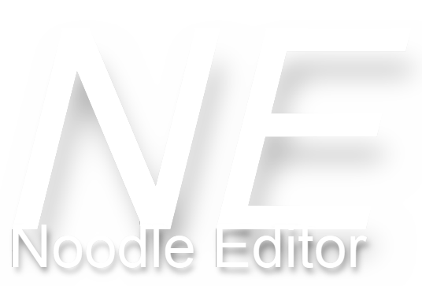

  

# Noodle Editor
**This editor does not have mapping features! For mapping please use [ChroMapper](https://github.com/Caeden117/ChroMapper)!**

## The Editor
Noodle Editor as an editor that helps you create [modcharts](https://github.com/Aeroluna/Heck).

We support: Noodle Extensions, Mapping Extensions and Chroma.
You can choose how to use each feature. For example if you use Noodle Extensions you can choose between: JavaScript or [Remapper](https://github.com/Swifter1243/ReMapper) by Swifter.

## Using
To use the editor you go to [releases](https://github.com/ForBone/NoodleEditor/releases/) and download the latest release!
To launch the editor you need to open the NoodleEditor.exe, then you are ready to go make modcharts!

## About
I started this project on June 07, 2024 with a mindset to create an easy to use editor for myself to make modcharts. Later down the road i decided to make this a project to bring out to the world to use. I wanted to make it open source so people could contribute and make this editor alot better because im not perfect at creating one!

## Contributing
To contribute to this project you have to clone this project into a new folder. Then open the cloned project in unity hub with unity version 2022.3.25f1. Your fully welcome to make pull requests with changes, we might add it to the editor!

## Roadmap 
**Need to add:**

 - Remapper support
 - Noodle extensions support
 - Chroma support
 - Map loading *(.dat difficulity files, song.ogg, cover.png)*
 - Writing to .dat difficulity files *(notes, events)*
 - Lighting *(v3)*

**Added:**
 - Json data *(colorNotes)* to notes
 - Grid  *(Scrolling  1/1 - 1/64,  Beats)*

# License

We use the [MIT License](./LICENSE)
 
